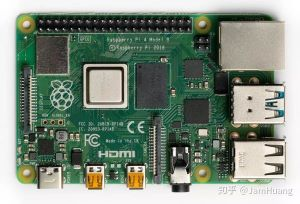
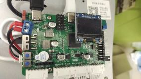

# 电子学社第二次培训

## 概述

硬件在不同领域中具有各种功能，因为不同的领域有不同的需求和用途。以下是硬件在一些常见领域中的功能示例：

​     						

1. 计算机领域：
   - 中央处理器（CPU）：执行计算和数据处理任务。
   - 内存（RAM）：存储计算机程序和数据，以便快速访问。
   - 存储设备（硬盘驱动器、固态驱动器）：永久性存储数据和程序。
   - 输入设备（键盘、鼠标、摄像头）：用于与计算机进行交互。
   - 输出设备（显示器、打印机、音响）：用于从计算机获取信息。
2. 通信领域：
   - 路由器和交换机：用于网络数据包的路由和交换。
   - 通信卫星：用于卫星通信，例如卫星电话和卫星互联网。
   - 手机：提供移动通信和数据连接。
   - 光纤电缆：用于高速互联网和通信。
3. 医疗领域：
   - 医疗影像设备（X射线、MRI、CT扫描仪）：用于诊断和治疗。
   - 生命监测设备（心电图、血压计）：用于监测患者的生命体征。
   - 医疗器械（手术机器人、假肢）：用于手术和康复。
4. 工业自动化：
   - 传感器（温度传感器、压力传感器）：监测生产过程中的参数。
   - 机械臂和机器人：执行装配、焊接和搬运任务。
   - 控制器（PLC、微控制器）：控制生产线和自动化设备。
5. 汽车工业：
   - 引擎控制单元（ECU）：控制引擎性能和燃油管理。
   - 传感器（汽车雷达、摄像头）：用于自动驾驶和驾驶辅助系统。
   - 娱乐系统（音响、导航、车载计算机）：提供信息和娱乐。
6. 农业领域：
   - GPS系统：用于农田导航和自动化农机械。
   - 传感器（土壤湿度、气象）：监测农田条件。
   - 自动化农机械：用于播种、收获和灌溉。

不同领域的硬件有各种不同的功能，用于满足该领域的需求，提高效率，增强控制和监测能力，甚至推动创新。硬件通常与相应的软件和算法结合使用，以实现特定领域的任务和目标。

## 1.认识元件

- 二极管,三极管,场效应管,电容电阻电感等

- 元件和芯片的封装

## 2.原理图

- 认识原理图上的走线
- 认识原理图上器件的符号
- 认识原理图上电源标号.

## 3.焊接

- 使用洞洞板,将其用锡连线
- 测试其功能

## 4.使用EDA来设计PCB

- 了解PCB的[工艺](https://www.bilibili.com/video/BV1u64y1Y7sW?p=5&vd_source=b279e35a0a303b80df2905504b3b727a)
- 学会原理图的绘制
- 使用软件进行PCB设计
- 学会在[嘉立创](https://lceda.cn/)上免费打板

## 5.焊接PCB

- 学会焊接贴片
- 进阶(器件布局,走线的艺术,铺铜,多层板等)

